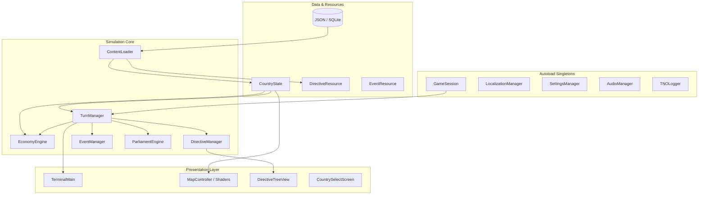

# 🌐 Архитектура проекта TNOGame (Godot 4)

## 📌 Общий обзор
**TNOGame** — глобальная геополитическая стратегия в сеттинге вселенной **The New Order: Last Days of Europe**, разработанная на игровом движке **Godot 4.7** (GDScript + Shaders) с CRT-стилизованным терминальным интерфейсом командного бункера 1960-х годов.

---

## 🏛️ Ключевые архитектурные уровни

---

## 🧩 Основные подсистемы

### 1. Ядро симуляции (`core/systems/`)
- **`TurnManager`** — центральный оркестратор дискретного времени. Управляет переходом между ходами (1 ход = 1 неделя), синхронизирует экономику, дипломатию, фазы ИИ и события.
  - `TurnSerializer` — snapshot-сериализация и сохранение игрового состояния (`user://savegame.json`).
  - `DemographicsEngine` — демографический рост, учет резервов людских ресурсов и потерь.
  - `TurnTerritoryHandler` — обработка передачи провинций, аннексий и обновление текстуры карты.
  - `TurnCrisisHandler` — эскалация кризисов, саботажи, перевороты и условия победы/поражения.
- **`EconomyEngine`** — симуляция реального и номинального ВВП, расчет доходов, госдолга, расходов на социальные и военные нужды, кредитного рейтинга и нефтяного кризиса 1970-х гг.
- **`DirectiveManager`** — система национальных фокусов и проектов развития. Управляет прогрессом директив, AST-условиями доступности и автопропусками.
- **`ContentLoader`** — потоковая динамическая загрузка игровых данных по тегам стран (720+ стран в базе данных).

### 2. Пользовательский интерфейс (`ui/`)
- **`TerminalMain`** — главный экран управления государством:
  - Командный HUD и верхняя статусная панель ресурсов.
  - Вкладки: Карта мира, Директивы, Экономика, Парламент, Вооруженные силы, Дипломатия, Разведка.
  - `TerminalSignalsConnector` — централизованная реактивная подписка на сигналы систем.
  - `TerminalScreenRegistry` — фабрика специализированных экранов и национальных механик.
- **`CountrySelectScreen`** — лобби выбора державы с интерактивной картой, CRT-постобработкой, досье наций, кабинетом министров и национальными духами.
- **`DirectiveTreeView`** — интерактивный DAG-граф национальных фокусов с ортогональными шинами, псевдографикой ходов и AST-инспектором.

### 3. Интерактивная карта мира (`scripts/map_controller.gd` + `shaders/`)
- Рендеринг карты мира на GPU через CanvasItem-шейдеры и 8-битную индексную маску провинций.
- Динамическая таблица поиска (LUT Texture) для мгновенной перекраски тысяч провинций без перерисовки геометрии.
- Режимы карты: политический, глобальные сферы влияния, экономика, развитие, военный.

---

## 🔒 Стандарты надежности и логирования
- Все системные сообщения направляются через синглтон **`TNOLogger`** (`INFO`, `WARN`, `ERROR`).
- Критические отказы сопровождаются вызовами `push_error()` с записью в системный лог.
- Автоматизированное тестирование бизнес-логики выполняется через `tests/run_all_tests.gd`.
