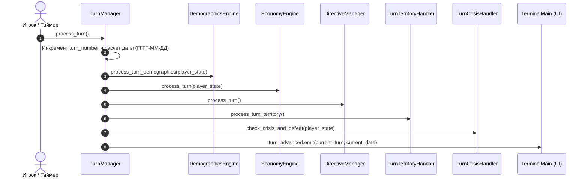

# ⏱️ TurnManager: Менеджер игрового времени и фаз хода

## 📌 Описание
Класс **`TurnManager`** (`core/systems/turn_manager.gd`) является центральным контроллером симуляции TNOGame. Он отвечает за продвижение дискретного игрового времени (шаг хода = 1 неделя), координацию расчетных фаз экономики, военных действий, дипломатии, ИИ и глобальных событий.

---

## 🏛️ Архитектура и модульная декомпозиция

`TurnManager` построен по модульному принципу и делегирует специализированные задачи вспомогательным классам:

```
TurnManager (Оркестратор фаз)
├── TurnSerializer.gd         # Сохранение, загрузка и создание снимков (snapshots)
├── DemographicsEngine.gd     # Еженедельный демографический рост, потери и мобилизация
├── TurnTerritoryHandler.gd   # Передача провинций, мирные договоры и синхронизация карты
└── TurnCrisisHandler.gd      # Саботажи, перевороты, проверки условий поражения и победы
```

---

## 🔄 Жизненный цикл хода (`process_turn`)

При вызове метода `process_turn()` или сигнала `advance_turn_requested` выполняется строгая последовательность фаз:



1. **Инкремент даты**: Прибавление 7 дней к текущей календарной дате.
2. **Фаза демографии (`DemographicsEngine`)**:
   - Расчет прироста населения на основе уровня медицины и стабильности.
   - Пополнение пула призывного контингента (manpower pool).
3. **Фаза макроэкономики (`EconomyEngine`)**:
   - Начисление доходов бюджета и налоговых сборов.
   - Выплата процентов по госдолгу, финансирование армии и госпрограмм.
   - Расчет реального роста ВВП и инфляции.
4. **Фаза директив (`DirectiveManager`)**:
   - Продвижение прогресса активных проектов на 1 неделю.
   - Автоматическое завершение выполненных директив и начисление наград.
5. **Фаза геополитики и кризисов (`TurnCrisisHandler`)**:
   - Проверка порогов банкротства (долг > 250% ВВП).
   - Проверка потери ключевых стратегических регионов (условия Defeat/Victory).
6. **Реактивное оповещение UI**: Эмиссия сигналов `turn_advanced` и `turn_completed`.

---

## 📡 Публичные сигналы и методы

### Сигналы
- `signal turn_advanced(turn_number: int, date_string: String)` — оповещение о завершении шага хода.
- `signal country_annexed(victim_tag: String, annexer_tag: String)` — фиксация аннексии державы.
- `signal campaign_victory(tag: String, victory_type: String)` — победа в кампании.
- `signal campaign_defeat(tag: String, reason: String)` — поражение игрока.

### Ключевые методы
```gdscript
func process_turn() -> void
"""Продвигает симуляцию на один ход вперед."""

func save_game(file_path: String = "user://savegame.json") -> bool
"""Сохраняет полное состояние мира в JSON-файл."""

func load_game(file_path: String = "user://savegame.json") -> bool
"""Восстанавливает игровое состояние из сохранения."""

func transfer_state(state_id: int, new_owner_tag: String) -> void
"""Осуществляет трансфер контроля над регионом с обновлением карты."""
```
